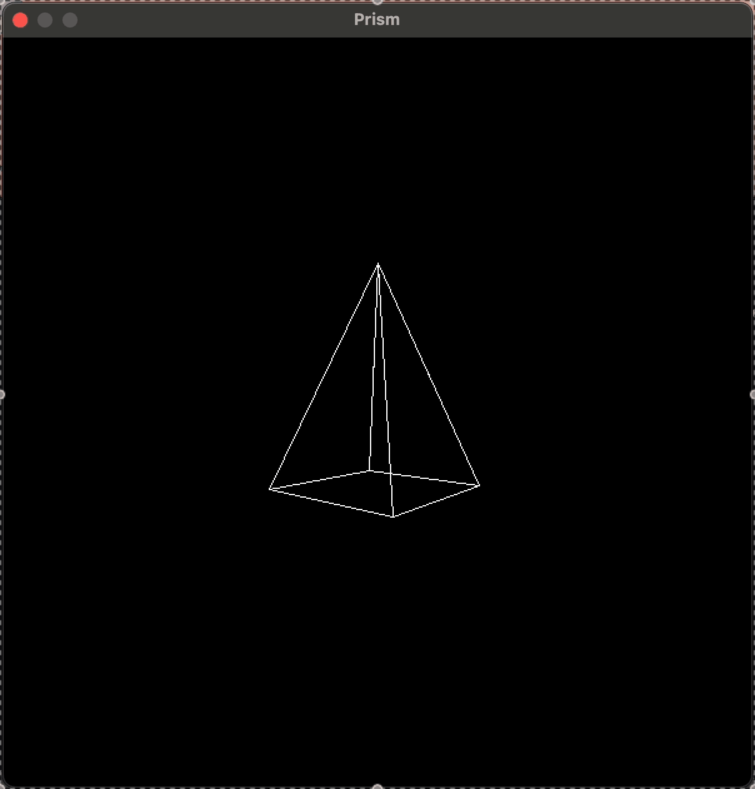

# Prism Rendering
 
In this project, I applied some basic linear algebra concepts that I just learnt to implement a simple 3D render of a prism.



## Method Overview

The method used to display and animate a 3D object is simple:

1. **Declare the vertices** of the 3D object (in homogeneous coordinates),
2. **Define the faces** by listing which vertices form each face,
3. **Apply a rotation transformation** to spin the object around its center,
4. **Translate the object along the Z-axis** to place it inside the viewable frustum,
5. **Apply a perspective projection** to simulate depth,
6. **Convert the projected coordinates** from normalized device space to window space (screen scaling),
7. **Draw the edges** by connecting the vertices according to the face definitions,
8. **Display the current buffer** onto the screen,
9. **Update the rotation angle** and **repeat the whole process** for the next frame.

## Build & Run

**No optimizations**
```bash
cargo run
```

**Optimized**
```bash
cargo run --release
```

You can change the prism's rotation speed directly in `main.rs`:
```rust
// Rotation speed
const THETA_ITERS: f32 = 0.01;
```

## File Overview

### Functions
- `main` → main loop and variable initializations
- `dot_product` → single point precision matrix multiplication
- `draw_line` → given two points it draws a line in a 2D matrix
- `draw` → draws the pixels in the window buffer

## License

[MIT](https://choosealicense.com/licenses/mit/)

